<h1 align="center">Cozy Clawd</h1>

<p align="center">
  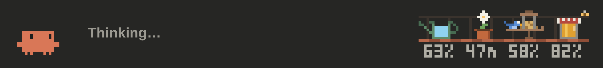
</p>

<p align="center">
  <b>A cozy pixel-art band above the prompt in Claude Code.</b><br>
  Clawd acts out what Claude is doing, beside a little scene of your session's context, prompt cache, and usage limits.
</p>

<p align="center">
  
  
</p>

Cozy Clawd is a mod for Claude Code: a plugin whose code runs inside Claude Code and draws on its screen. It adds a band of pixel art above the prompt, in the Code tab of the Claude desktop app and in the terminal. On the left, Clawd acts out each step of a turn. On the right, four objects work as meters of your session: the context left, the minutes left on the prompt cache, and what's left of your five-hour and weekly usage limits.

Cozy Clawd is an unofficial fan project. It isn't affiliated with or endorsed by Anthropic. Claude and Claude Code are trademarks of Anthropic, and Clawd is Anthropic's character; the MIT License covers this project's code, not Anthropic's marks.

## Install

Cozy Clawd needs the following:

- Claude Code 2.1.287 or later, where mods are on by default.
- The Code tab of the Claude desktop app, or a terminal. For the scenes' true colors, use a terminal with 24-bit color (truecolor), such as Windows Terminal or iTerm2; other terminals show approximate colors.

> **Note:** A mod is code that runs inside Claude Code with your permissions. For what Cozy Clawd reads, keeps, and runs, see [What the mod does on your machine](#what-the-mod-does-on-your-machine). To list what it hooks and calls, clone the repository and run `claude plugin validate .` from its root; it passes with a warning about `CLAUDE.md` at the plugin root, which is expected. For more information, see [Decide whether to trust a mod](https://code.claude.com/docs/en/plugins/mods/overview#decide-whether-to-trust-a-mod).

To install the mod for your user account, run the following commands in a terminal:

```bash
claude plugin marketplace add OrihuelaConde/claude-plugins
```

```bash
claude plugin install cozy-clawd@orihuelaconde
```

The first command adds `orihuelaconde`, the plugin marketplace that lists OrihuelaConde's plugins, and the second installs the `cozy-clawd` plugin from it. The band appears in the next session you start, in the terminal or in the desktop app. To load the mod in a terminal session that's already open, run `/reload-plugins`.

You can also install the mod in the following ways:

- **From a terminal session.** Run `/plugin install cozy-clawd --marketplace OrihuelaConde/claude-plugins`, confirm the marketplace, and then select **Install for you (user scope)**.
- **From the desktop app.** After you add the marketplace with the first command, click **+** next to the prompt box in the Code tab, select **Plugins** > **Add plugin**, select **cozy-clawd**, and then choose your user account as the scope.

### Update or uninstall the mod

By default, Claude Code doesn't update the mod. To update it, run the following command:

```bash
claude plugin update cozy-clawd@orihuelaconde
```

Then start a new session, or run `/reload-plugins` in an open terminal session.

To install updates automatically, run `/plugin` in a terminal session, go to the **Marketplaces** tab, select `orihuelaconde`, and then select **Enable auto-update**.

To turn the mod off and keep it installed, run `claude plugin disable cozy-clawd@orihuelaconde`. To uninstall it, run `claude plugin uninstall cozy-clawd@orihuelaconde`.

## What Clawd does

Each step of a turn has its own scene, and each family of tools has its own prop. Beside Clawd, the band says what Claude is doing, in the tool's own words when it knows the tool, such as "Reading a file…" or "Searching the code…".

<table>
  <tr>
    <td align="center">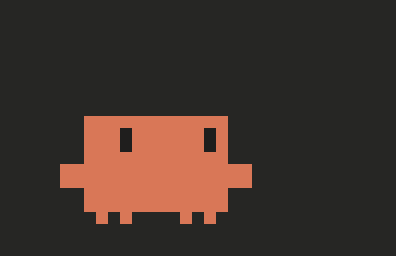<br><b>Thinking</b><br>Thought dots light a bulb</td>
    <td align="center"><br><b>Working on the answer</b><br>Clawd stacks blocks</td>
    <td align="center"><br><b>Writing the answer</b><br>Lines of text appear</td>
  </tr>
  <tr>
    <td align="center">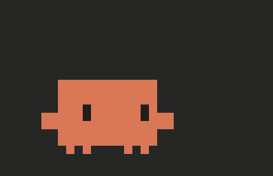<br><b>Reading files</b><br>A magnifier sweeps a page</td>
    <td align="center"><br><b>Editing files</b><br>A pencil writes</td>
    <td align="center">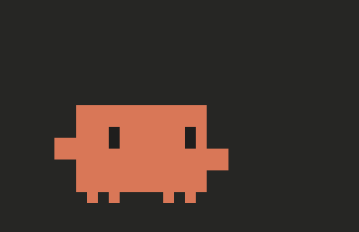<br><b>Running a command</b><br>Code rains on a monitor</td>
  </tr>
  <tr>
    <td align="center">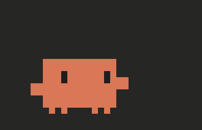<br><b>Browsing the web</b><br>A desk globe turns</td>
    <td align="center">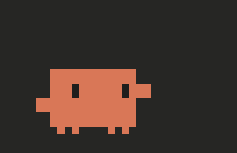<br><b>Launching a subagent</b><br>A small Clawd runs off</td>
    <td align="center">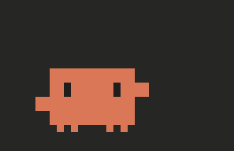<br><b>Any other tool</b><br>Clawd hammers away</td>
  </tr>
  <tr>
    <td align="center"><br><b>Compacting</b><br>Sheets pressed into a block</td>
    <td align="center">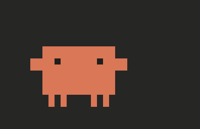<br><b>Compacted</b><br>A hop for joy</td>
    <td align="center">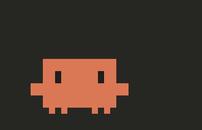<br><b>Waiting</b><br>Rest and pastimes</td>
  </tr>
  <tr>
    <td align="center">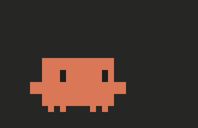<br><b>Cache running out</b><br>A drop of sweat</td>
    <td align="center">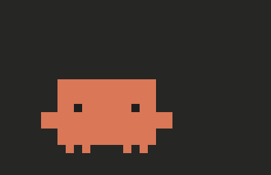<br><b>Cache almost out</b><br>A yawn</td>
    <td align="center">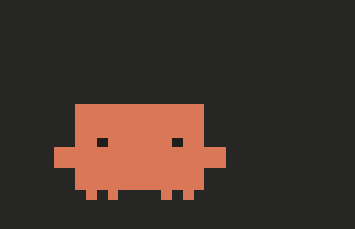<br><b>Cache expired</b><br>Asleep</td>
  </tr>
</table>

Between turns, Clawd rests, breathing slowly, blinking, and glancing around. For 9 seconds of every 39, it takes up a pastime picked at random: looking around, whistling, juggling, playing with a yo-yo, blowing soap bubbles, reading, dancing, or following a ladybug. While Claude waits for your approval or your answer, Clawd goes through its pastimes one after another, in random order, with a short rest between them.

When 10 minutes or less are left on an hour's prompt cache, Clawd frets with a drop of sweat. With 2 minutes or less, it yawns. A five-minute cache gets the same shares of its life: 50 and 10 seconds. Once the cache expires, Clawd falls asleep.

## Read the meters

The right side of the band shows four meters of your session, each an object with its number underneath in a pixel font. From left to right, they show the following:

1. The context window left, as a percentage.
2. The minutes left on the prompt cache, counted down from Claude's last answer.
3. What's left of your five-hour usage limit.
4. What's left of your weekly usage limit.

The cache meter counts down the length Claude Code keeps the cache for: an hour when you sign in with a Claude subscription, and five minutes with an API key or once you use up a usage limit. With an API key, Claude Code reports no usage limits, so the two usage-limit meters show `--`. For more information, see [What the meters measure](docs/scenes.md#what-the-meters-measure).

Each scene draws the meters as objects of its own. The images in this README show the `balcony` scene, which the band shows until you choose another: a watering can, a daisy in a pot, a bird feeder, and a jar of honey. For all eight, see [Choose a scene](#choose-a-scene).

When 25% or less of the context is left, a **Compact** button appears next to the scene. It asks you to confirm, and then compacts the conversation. While Claude compacts, the context meter fills up again: on the balcony, it rains into the watering can.

<p align="center">
  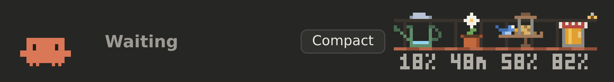
</p>

## Customize the band

The `/cozy-clawd` panel holds the mod's settings. A change applies at once, and later sessions start with it.

| Setting | Choices | Default | Details |
| --- | --- | --- | --- |
| Scene | Eight scenes | `balcony` | [Scenes](docs/scenes.md) |
| Size, in a terminal only | **Small** or **Large** | **Small** | [The band in a terminal](docs/terminal.md) |
| Language | Ten languages, or **Automatic** | **Automatic** | [Languages](docs/languages.md) |

### Choose a scene

To choose a scene, open the `/cozy-clawd` panel and select **Use** under the scene you want. In a terminal, the panel has a **Scene** picker instead. You can also switch the scene from the prompt with the following command:

```text
/cozy-clawd-scene SCENE_NAME
```

Replace `SCENE_NAME` with the name of a scene, such as `mate`. To see the current scene and the names available, run `/cozy-clawd-scene` with no name.

<table>
  <tr>
    <td align="center"><a href="docs/scenes.md#balcony">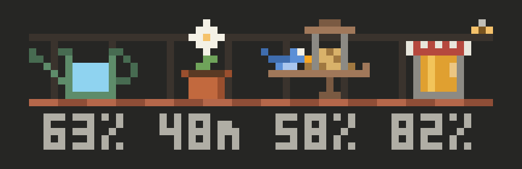</a><br><b>Balcony</b> <code>balcony</code> (default)</td>
    <td align="center"><a href="docs/scenes.md#mate">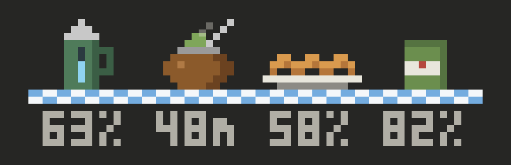</a><br><b>Mate</b> <code>mate</code></td>
  </tr>
  <tr>
    <td align="center"><a href="docs/scenes.md#teatime">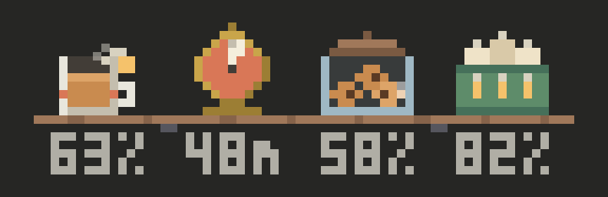</a><br><b>Teatime</b> <code>teatime</code></td>
    <td align="center"><a href="docs/scenes.md#night-window">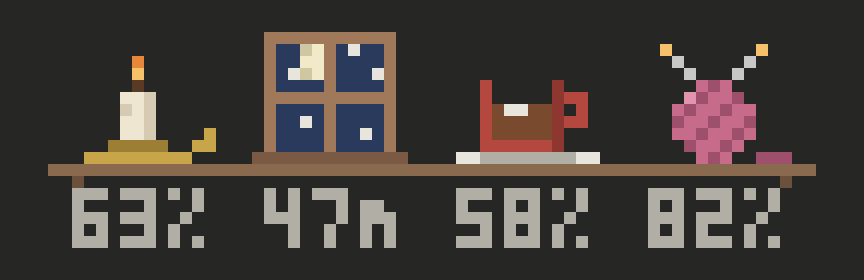</a><br><b>Night window</b> <code>window</code></td>
  </tr>
  <tr>
    <td align="center"><a href="docs/scenes.md#adventure">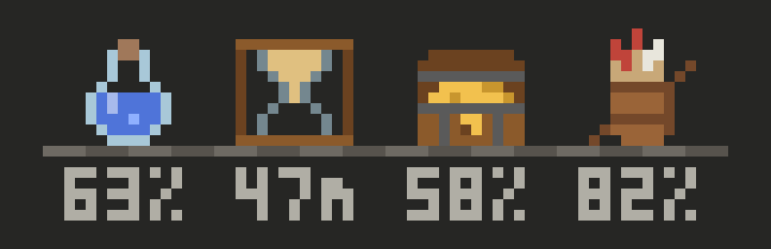</a><br><b>Adventure</b> <code>adventure</code></td>
    <td align="center"><a href="docs/scenes.md#gamer">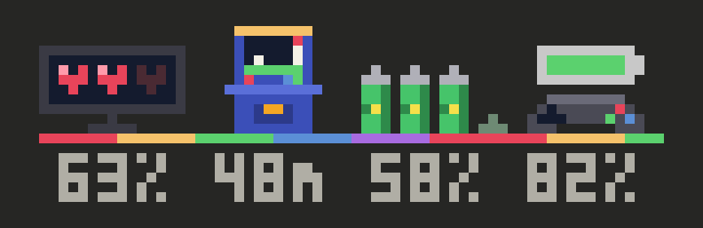</a><br><b>Gamer</b> <code>gamer</code></td>
  </tr>
  <tr>
    <td align="center"><a href="docs/scenes.md#cyberpunk">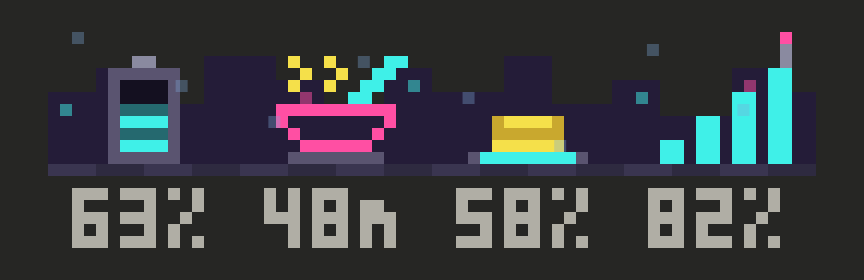</a><br><b>Cyberpunk</b> <code>cyberpunk</code></td>
    <td align="center"><a href="docs/scenes.md#steampunk">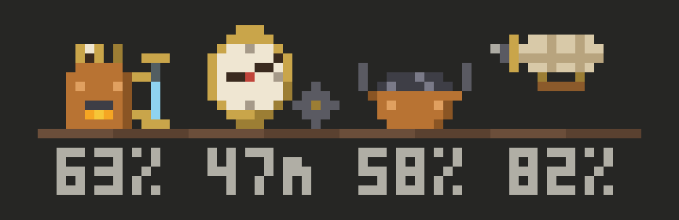</a><br><b>Steampunk</b> <code>steampunk</code></td>
  </tr>
</table>

For what each object shows, see [Scenes](docs/scenes.md).

## The band in a terminal

A terminal can't show the images the desktop app draws, so there the mod paints each scene in block characters and animates it frame by frame. The scenes, the cache's countdown, and the **Compact** button work as they do in the desktop app.

In a terminal, the band comes in two sizes. The small size, the default, has drawings of its own and takes 5 rows and at least 75 columns. The large size shows the desktop app's drawings and takes 9 rows and at least 109 columns. To change the size, use the **Size** picker in the `/cozy-clawd` panel. In the following image, the small size is above and the large size is below:

<p align="center">
  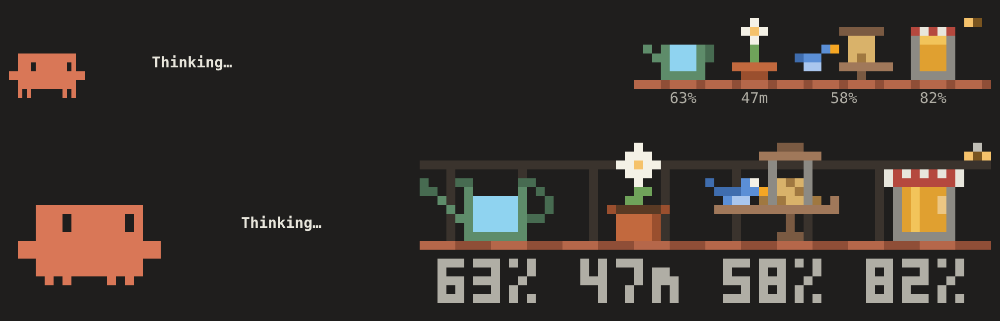
</p>

For what each size shows, how the band fits a narrow terminal, and how to get true colors in Windows Terminal or tmux, see [The band in a terminal](docs/terminal.md).

## Troubleshoot

### The band doesn't appear

Check the following:

- Claude Code is version 2.1.287 or later. To see the version, run `claude --version`.
- The session started after you installed the mod. To load the mod in a terminal session that was already open, run `/reload-plugins`.
- The mod is turned on. To turn it back on, run `claude plugin enable cozy-clawd@orihuelaconde`.

### The colors look off in a terminal

With fewer than 24-bit colors, Claude Code approximates the scenes' colors, which shifts them. To fix it, see [Get true colors in Windows Terminal](docs/terminal.md#get-true-colors-in-windows-terminal) or [Get true colors in tmux](docs/terminal.md#get-true-colors-in-tmux).

### The band shows words instead of pictures

The terminal is too narrow, or too short, for the drawings. The small size needs 5 rows and at least 75 columns, and the large size needs 9 rows and at least 109 columns, plus a few columns while the **Compact** button shows. Enlarge the window, or choose the small size in the `/cozy-clawd` panel.

## What the mod does on your machine

Cozy Clawd makes no network requests, reads and writes no files, and sets no environment variables. It keeps three choices in Claude Code's plugin store: the scene, the language, and the size. It watches each turn's events only to know what to draw, and passes them on unchanged. To find your language, it can run `reg.exe query` on Windows or `defaults read` elsewhere. For the full list, see [What Cozy Clawd does on your machine](docs/on-your-machine.md).

## Contribute

To report a problem or suggest an idea, open an issue. The texts in languages other than English and Spanish are machine translations; to suggest a better one, open an issue or a pull request that edits the language's file in `hooks/languages/`. To work on the mod, see [Contribute to Cozy Clawd](CONTRIBUTING.md).

## License

Cozy Clawd is released under the [MIT License](LICENSE).
