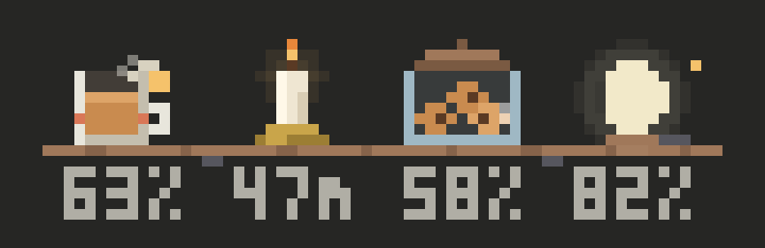

<h1 align="center">Cozy Clawd</h1>

<p align="center">
  
</p>

<p align="center">
  <b>A cozy pixel-art band above the prompt in Claude Code.</b><br>
  Clawd acts out what Claude is doing, beside a little scene of your session's context, prompt cache, and usage limits.
</p>

<p align="center">
  
  
  
</p>

Cozy Clawd is a Claude Code mod, a plugin of function hooks. It draws a band above the prompt in the Code tab of the Claude desktop app and in the terminal. On the left, Clawd acts out each step of a turn. On the right, a scene of four objects shows how much context is left, how long the prompt cache lasts, and what's left of your five-hour and weekly usage limits.

Cozy Clawd is an unofficial fan project. It isn't affiliated with or endorsed by Anthropic.

- [Install](#install)
- [What Clawd does](#what-clawd-does)
- [Read the session figures](#read-the-session-figures)
- [The band in a terminal](#the-band-in-a-terminal)
- [Choose a scene](#choose-a-scene)
- [Choose the language](#choose-the-language)
- [Development](#development)

## Install

Cozy Clawd runs in Claude Code v2.1.287 or later, where mods are on by default. The band draws in the Code tab of the Claude desktop app and in a terminal with 24-bit color (truecolor), such as Windows Terminal or iTerm2. For how the band fits in a terminal, and how to get true colors in Windows Terminal, see [The band in a terminal](#the-band-in-a-terminal).

> **Note:** A mod is code that runs inside Claude Code with your permissions. To list what Cozy Clawd hooks and calls before you install it, clone the repository and run `claude plugin validate .claude-plugin/plugin.json`. For more information, see [Decide whether to trust a mod](https://code.claude.com/docs/en/plugins/mods/overview#decide-whether-to-trust-a-mod).

This repository is its own plugin marketplace, named `cozy-clawd`.

### Install from a terminal

To install the mod for your user account, run the following commands in a terminal:

```bash
claude plugin marketplace add OrihuelaConde/cozy-clawd
```

```bash
claude plugin install cozy-clawd@cozy-clawd
```

The terminal and the desktop app read the same settings, so the band appears in the next session you start in either. In a terminal session that's already open, run `/reload-plugins` to load the mod.

### Install from a Claude Code session

To add the marketplace and install the mod in one step, run the following command in a terminal session:

```text
/plugin install cozy-clawd --marketplace OrihuelaConde/cozy-clawd
```

Claude Code asks you to confirm the marketplace, then shows the mod's details. Select **Install for you (user scope)**.

### Install from the desktop app

The desktop app's plugin browser lists the plugins of the marketplaces you've added. To install the mod from it, do the following:

1. In a terminal, add the marketplace:

   ```bash
   claude plugin marketplace add OrihuelaConde/cozy-clawd
   ```

2. In the Code tab, click **+** next to the prompt box, and then select **Plugins** > **Add plugin**.
3. Select **cozy-clawd**, and then choose your user account as the scope.

### Update the mod

Updates from this marketplace don't install by themselves. To update the mod, run the following command in a terminal:

```bash
claude plugin update cozy-clawd@cozy-clawd
```

To have updates install by themselves, run `/plugin` in a terminal session, go to the **Marketplaces** tab, select `cozy-clawd`, and then select **Enable auto-update**.

### Turn off or uninstall the mod

To turn the mod off and keep it installed, run `claude plugin disable cozy-clawd@cozy-clawd`. To remove it, run `claude plugin uninstall cozy-clawd@cozy-clawd`.

## What Clawd does

Each step of a turn has its own scene, and each family of tools has its own prop. The band says the step in words beside Clawd.

<table>
  <tr>
    <td align="center"><br><b>Thinking</b><br>Thought dots light a bulb</td>
    <td align="center"><br><b>Working on the answer</b><br>Clawd stacks blocks</td>
    <td align="center"><br><b>Writing the answer</b><br>Lines of text appear</td>
  </tr>
  <tr>
    <td align="center"><br><b>Reading files</b><br>A magnifier sweeps a page</td>
    <td align="center"><br><b>Editing files</b><br>A pencil writes</td>
    <td align="center"><br><b>Running a command</b><br>Code rains on a monitor</td>
  </tr>
  <tr>
    <td align="center"><br><b>Browsing the web</b><br>A desk globe turns</td>
    <td align="center"><br><b>Launching a subagent</b><br>A small Clawd runs off</td>
    <td align="center"><br><b>Any other tool</b><br>Clawd hammers away</td>
  </tr>
  <tr>
    <td align="center"><br><b>Compacting</b><br>Sheets pressed into a block</td>
    <td align="center"><br><b>Compacted</b><br>A hop for joy</td>
    <td align="center"><br><b>Waiting</b><br>Rest and pastimes</td>
  </tr>
  <tr>
    <td align="center"><br><b>Cache running out</b><br>A drop of sweat</td>
    <td align="center"><br><b>Cache almost out</b><br>A yawn</td>
    <td align="center"><br><b>Cache expired</b><br>Asleep</td>
  </tr>
</table>

Between turns, Clawd rests, breathing slowly, blinking, and glancing around. After 30 seconds it takes up a pastime for 9 seconds, picked at random: looking around, whistling, juggling, playing with a yo-yo, blowing soap bubbles, reading, dancing, or following a ladybug. While Claude waits for your approval or answer, Clawd passes the time with its pastimes, one after another in a random order, with a short rest between them.

As the prompt cache runs out, Clawd frets with a drop of sweat when 10 minutes or less are left, and yawns when 2 minutes or less are left. Once the cache expires, Clawd sleeps with z's drifting up.

## Read the session figures

The right side of the band shows four figures of your session, each as an object with its number underneath in a pixel font. In the `balcony` scene, the one in these images, the objects stand on a sunny balcony:

- A watering can's water shows the context window left. At 25% or less, a rain cloud gathers over it.
- A daisy in a pot wilts over the one-hour prompt cache. The number under it counts down the minutes left.
- A bluebird pecks at a feeder whose seeds are what's left of the five-hour usage limit.
- A jar of honey, with a bee buzzing around it, empties as you use the weekly limit.

Each scene draws the same four figures its own way. For the other seven, see [Choose a scene](#choose-a-scene).

When 25% or less of the context is free, a **Compact** button appears next to the scene. It asks for confirmation before it compacts the conversation. While Claude compacts, the context figure fills up again: on the balcony, it rains into the watering can.

<p align="center">
  
</p>

## The band in a terminal

A terminal can't show the SVG images the desktop app draws, so there the mod paints each scene in block characters and moves it frame by frame. The scenes, the cache's countdown, and the **Compact** button work as they do in the desktop app. Claude Code's own spinner stays as it is.

### Choose the size

In a terminal, the band comes in two sizes:

| Size | What it shows |
| --- | --- |
| Compact | Clawd drawn the way Claude Code draws it on its welcome screen, four pixels to a character cell, and a smaller drawing of the scene, two pixels to a cell, with the figures' numbers in plain text under it. Each figure shows four steps: more than half left, half or less, a quarter or less, and nothing. Clawd and the figures side by side take 5 rows and at least 71 columns. A few extras of the large drawings have no room in the compact ones, such as the shelf's teapot and the mate's kettle. |
| Large | The scenes the desktop app shows, two pixels to a character cell. Clawd and the figures side by side take 9 rows and at least 105 columns. |

The compact size is the default. To choose the size, open the `/cozy-clawd` pane in a terminal and select **Compact** or **Large** in the **Size** picker. The band switches at once, and later sessions start with the size you chose. The desktop app always shows the large size.

While the **Compact** button for compacting the conversation shows, the band takes a few more columns. A terminal too narrow for Clawd and the figures side by side shows Clawd with the figures in words, and a narrower one shows the step and the figures in words alone.

### Get true colors in Windows Terminal

In Windows Terminal, the band can come out in fewer colors than the scenes use, with the wood of the shelf turning olive, for example. To have Claude Code draw in 24-bit color, set the `FORCE_COLOR` variable to `3` before you start it. In PowerShell, run the following command:

```powershell
$env:FORCE_COLOR = '3'; claude
```

The variable lasts for that PowerShell session. To set it in every session, add `$env:FORCE_COLOR = '3'` to your PowerShell profile, the file that `$PROFILE` names.

## Choose a scene

The figures can be drawn as one of eight scenes. To choose the scene, use one of the following:

- Run the `/cozy-clawd-scene` command with the scene's name:

  ```text
  /cozy-clawd-scene SCENE_NAME
  ```

  Replace `SCENE_NAME` with the name of one of the following scenes, such as `balcony`. Run `/cozy-clawd-scene` with no name to see the current scene and the ones available.
- Open the `/cozy-clawd` pane, which shows each scene with your session's figures, and select **Use** under the one you want. In a terminal, the pane has a **Scene** picker instead.

The band switches to the new scene at once, and later sessions start with it. Until you choose one, the band shows the `shelf` scene.

### Balcony (`balcony`)


A sunny balcony. A watering can's water shows the context left; at 25% or less a rain cloud gathers over it, and while the conversation is compacted it rains into the can. A daisy in a pot wilts over the prompt cache's hour. A bluebird pecks at a feeder whose seeds are what's left of the five-hour limit, and a jar of honey, a bee buzzing around it, empties as you use the weekly limit.

### Mate (`mate`)


A checked tablecloth set for mate. A thermos's strip of water shows the context left, and at 25% or less a steaming kettle waits beside it; while the conversation is compacted, the kettle boils and the thermos fills up. The mate's steam fades over the prompt cache's hour, and the yerba washes out when the cache expires. A plate holds a medialuna for every quarter of the five-hour limit left, and a pack of yerba flattens as you use the weekly limit.

### Night window (`window`)


A desk by a window at night. A candle is as tall as the context left; at 25% or less a spare candle stands by, and while the conversation is compacted the candle grows back. The moon crosses the window over the prompt cache's hour and sets when the cache expires. A cup of cocoa shows what's left of the five-hour limit, its steam thinning as it goes down, and a ball of yarn shrinks as you use the weekly limit.

### Adventure (`adventure`)


An adventurer's gear on the stone floor of a keep. A mana potion is as full as the context left; at 25% or less a spare vial waits beside it, and while the conversation is compacted the potion fills up again, sparkling. An hourglass runs over the prompt cache's hour. A chest's heap of gold is what's left of the five-hour limit, and a quiver loses its arrows as you use the weekly limit.

### Gamer (`gamer`)


A gaming desk lit by an RGB strip. A monitor shows three hearts of health for the context left; at 25% or less the last one blinks, and while the conversation is compacted the hearts heal. On an arcade cabinet a little hero walks to the flag over the prompt cache's hour; when the cache expires it's game over. Cans of energy drink are what's left of the five-hour limit, and a gamepad's battery runs down as you use the weekly limit.

### Cyberpunk (`cyberpunk`)


A rooftop in the rain under a neon skyline. A power cell's charge shows the context left; at 25% or less it flickers pink beside a loose cable, and while the conversation is compacted the cable is plugged in and the cell charges. A neon sign of a bowl of noodles goes out tube by tube over the prompt cache's hour, until it's dark. A stack of credit chips is what's left of the five-hour limit, and signal bars drop as you use the weekly limit.

### Steampunk (`steampunk`)


Brass and copper machines in a workshop. A boiler's sight glass shows the context left; at 25% or less its fire dies down, the gauge drops into the red, and while the conversation is compacted it whistles and the glass fills up. A pocket watch's minute hand goes round over the prompt cache's hour and stops when the cache expires. A scuttle of coal is what's left of the five-hour limit, and an airship comes down as you use the weekly limit.

### Shelf (`shelf`)



A wooden shelf on iron brackets. A mug of tea shows the context left; at 25% or less it stops steaming and a teapot stands beside it, and while the conversation is compacted the teapot pours and the mug fills up again. A candle in a brass holder burns down over the prompt cache's hour and goes out when the cache expires. A cookie jar holds a cookie for every fifth of the five-hour limit left, and crumbs once only a couple remain. A moon lamp wanes, its glow shrinking, as you use the weekly limit.

## Choose the language

The mod speaks the languages the Claude desktop app shows: English, French, German, Hindi, Indonesian, Italian, Japanese, Korean, Portuguese (as spoken in Brazil), and Spanish. Claude Code doesn't tell a mod which one the app shows, so by default the mod goes by the following, in order:

1. The **Language** setting in `/config`, the language Claude answers in, when you've set it.
2. Your system's locale variables, `LC_ALL`, `LC_MESSAGES`, and `LANG`, where they're set.
3. Your system's language: on Windows, the first of your preferred languages, then the regional format; on macOS, the first of your preferred languages. The desktop app usually starts without the locale variables, so this is what it goes by.
4. English, when none of these names a language the mod speaks.

To choose the language yourself, open the `/cozy-clawd` pane and select the language by its own name, such as **Español** or **日本語**, next to **Language**. To go back to the automatic language, select **Automatic**. In a terminal, the pane has a **Language** picker instead. Later sessions start with the language you chose.

In a terminal, the band and the pane speak English when the language is Hindi. Claude Code lays out Devanagari narrower than a terminal draws it, so Hindi text comes out garbled there.

The command names (`/cozy-clawd`, `/cozy-clawd-scene`) and the scene names the `/cozy-clawd-scene` command takes stay the same in every language.

> **Note:** The texts in languages other than English and Spanish are machine translations. To suggest a better one, open an issue or a pull request that edits the language's file in `hooks/languages/`.

## Development

The mod is a Claude Code plugin of function hooks:

| Path | Contents |
| --- | --- |
| `hooks/register.tsx` | The hooks module: Clawd's scenes, how the mod follows the turn, the band, and the `/cozy-clawd` pane. |
| `hooks/compact.ts` | Clawd's scenes in the terminal's compact size. |
| `hooks/language.ts` | The languages the mod speaks, and how it tells which one you use. |
| `hooks/languages/` | The mod's texts, one file per language. `en.ts` sets the texts every language has. |
| `hooks/raster.ts` | How the terminal paints the scenes: a reader of the SVG and CSS they're drawn with that paints any moment of their animations in block characters, two or four pixels to a cell. Also how many columns a text takes there. |
| `hooks/scenes/index.ts` | The scenes the session figures can be drawn as, and the figures in words. |
| `hooks/scenes/pixels.ts` | What the figure scenes share: their layout, the pixel font of the numbers, the cache's countdown, and the refill while compacting. |
| `hooks/scenes/shelf.ts` | The `shelf` scene: a shelf of objects. |
| `hooks/scenes/mate.ts` | The `mate` scene: a tablecloth set for mate. |
| `hooks/scenes/balcony.ts` | The `balcony` scene: a balcony with a watering can and a daisy. |
| `hooks/scenes/window.ts` | The `window` scene: a desk by a window at night. |
| `hooks/scenes/adventure.ts` | The `adventure` scene: an adventurer's gear in a keep. |
| `hooks/scenes/gamer.ts` | The `gamer` scene: a gaming desk. |
| `hooks/scenes/cyberpunk.ts` | The `cyberpunk` scene: a rainy neon rooftop. |
| `hooks/scenes/steampunk.ts` | The `steampunk` scene: brass and copper machines. |
| `types/index.d.ts` | The contract for the values the mod keeps in the session's state. |
| `hooks/cozy-clawd.test.tsx` | Tests that run against the engine. |
| `.claude-plugin/plugin.json` | The plugin's manifest. |
| `.claude-plugin/marketplace.json` | The marketplace that lists the plugin, so it installs by name. |
| `tools/preview.mjs` | A script that renders Clawd's scenes and a few states of each figure scene to an HTML page, as images and as the terminal paints them. |
| `tools/readme-images.mjs` | A script that renders the README's GIFs to `docs/images/`. |

### Load the mod from a clone

To work on the mod, load it from your clone instead of the marketplace. If you installed it from the marketplace, turn that copy off first with `claude plugin disable cozy-clawd@cozy-clawd`, so only one copy draws the band.

To load the clone in every session, including the desktop app's, add its folder to the `CLAUDE_CODE_PLUGIN_DIRS` variable in the `env` block of your user settings file, `~/.claude/settings.json`:

```json
{
  "env": {
    "CLAUDE_CODE_PLUGIN_DIRS": "C:\\Users\\YOUR_USER\\source\\repos\\cozy-clawd"
  }
}
```

Replace the path with the folder where you cloned the repository. To list several folders, separate them with your platform's path-list separator: `;` on Windows, `:` on macOS and Linux. Claude Code watches the folder and reloads the mod when its files change.

To load the clone in a single terminal session instead, start Claude Code with the `--plugin-dir` flag:

```bash
claude --plugin-dir PATH_TO_COZY_CLAWD
```

Replace `PATH_TO_COZY_CLAWD` with the folder where you cloned the repository.

### Check the mod

To check the mod the way the engine reads it, run the following commands from the repository root. With a marketplace file in the repository, `claude plugin validate .` checks the marketplace, so the first command names the plugin's manifest:

```bash
claude plugin validate .claude-plugin/plugin.json
```

```bash
claude plugin validate .
```

```bash
claude plugin test .
```

To see Clawd's scenes and each figure scene without running a session, generate the preview page and serve the `.preview` folder:

```bash
node tools/preview.mjs
```

```bash
python -m http.server 8765 --directory .preview
```

Open `http://localhost:8765` in a browser. The page shows each scene at band size, enlarged, and as the terminal paints it, with cells of 9 by 18 pixels. Generating the terminal's version takes Node.js 22.13 or later.

### Render the README's images

The GIFs in `docs/images/` come from the mod's own drawing code. To render them again after a scene changes, you need [ffmpeg](https://ffmpeg.org/) on your `PATH`. Then run the following commands from the repository root:

```bash
npm install --no-save playwright
```

```bash
npx playwright install chromium
```

```bash
node tools/preview.mjs
```

```bash
node tools/readme-images.mjs
```

### Publish a release

Users who installed the mod from the marketplace get an update only when its version changes. To publish a release, increment `version` in `.claude-plugin/plugin.json` and push.

> **Note:** The plugin API for function hooks can change between Claude Code releases.

## License

Cozy Clawd is released under the [MIT License](LICENSE).
